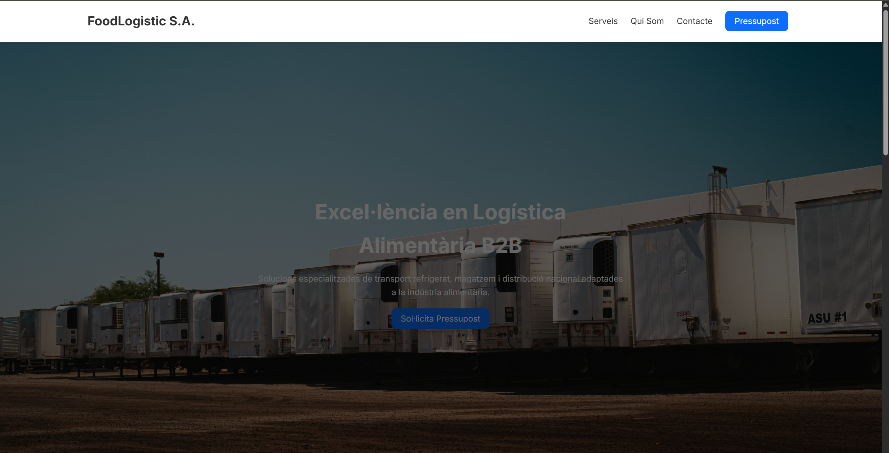
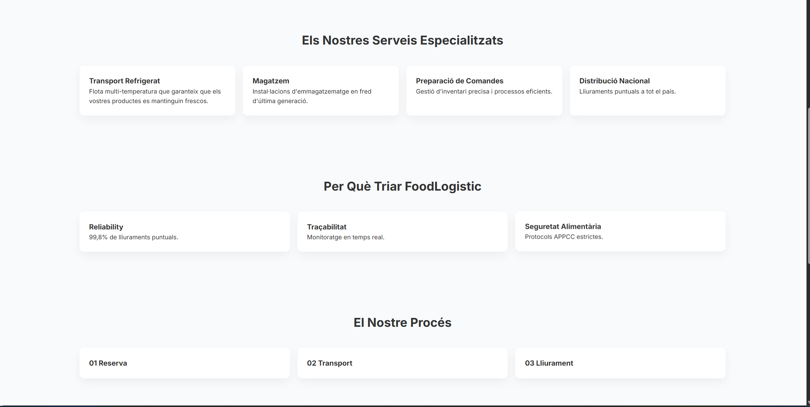
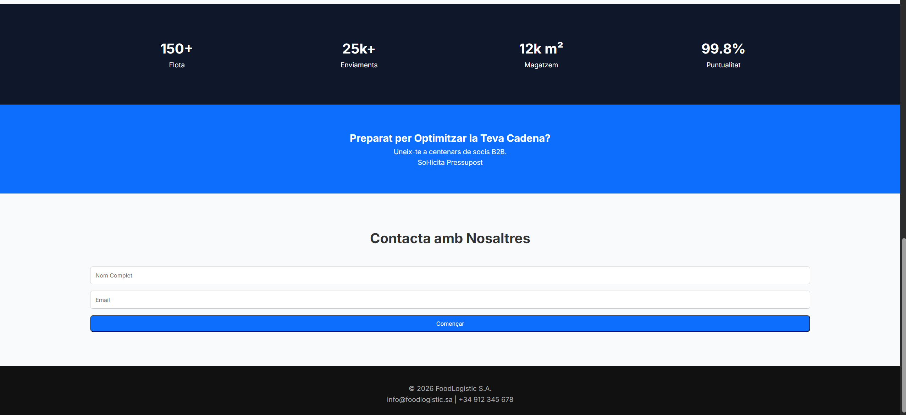
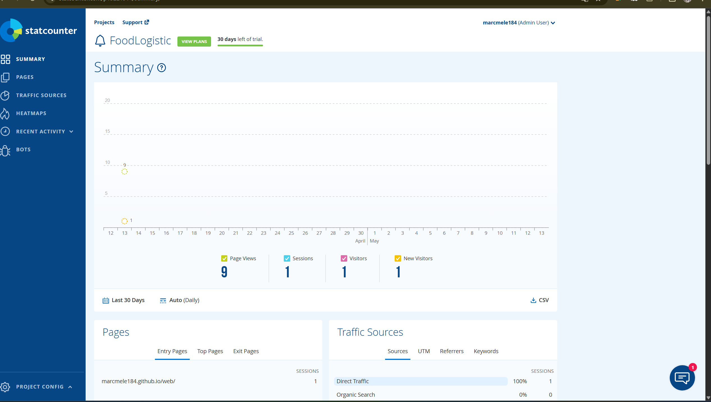

# T02: Proposta de pàgina corporativa

## Breu descripció del projecte

En aquesta activitat s’ha desenvolupat una proposta de pàgina web corporativa per a **FoodLogistic S.A.**, amb l’objectiu de modernitzar la seva presència digital i oferir una imatge més professional, actual i adaptada a les necessitats d’una empresa del sector logístic alimentari.

La solució s’ha creat com una **web estàtica responsive**, publicada mitjançant **GitHub Pages**, i s’hi ha integrat **StatCounter** com a eina d’analítica per fer el seguiment de les visites.

## Solució realitzada

Per a la realització d’aquesta activitat s’ha creat una web corporativa amb una estructura clara i orientada a empresa, incloent els apartats principals de:

- Inici
- Serveis
- Sobre nosaltres
- Contacte

També s’ha afegit una petita secció informativa de caràcter legal i s’ha configurat la publicació del lloc web amb **GitHub Pages** a partir de la carpeta `docs` del repositori.

### Repositori públic de la web
[REPO](https://github.com/marcmele184/web)

### URL pública de la pàgina
[Web](https://marcmele184.github.io/web/)

## Tecnologies i recursos utilitzats

- HTML
- CSS
- Git i GitHub
- GitHub Pages
- StatCounter
- TeleportHQ per a la generació inicial de l’estructura visual de la pàgina

## Captures de la web

### Vista general de la pàgina d’inici

### Secció de serveis

### Secció de contacte

## Integració de StatCounter

Per tal de mesurar l’activitat de la pàgina web, s’ha integrat **StatCounter** amb un comptador invisible. El codi de seguiment s’ha afegit al fitxer `index.html`, just abans del tancament de l’etiqueta `</body>`.

Aquesta eina permet obtenir informació útil sobre el funcionament de la pàgina i el comportament dels visitants.

## Mètriques observades amb StatCounter

Les mètriques principals que ofereix StatCounter i que es poden consultar des del panell de control són:

- Nombre de visites
- Visitants únics
- Pàgines vistes
- Procedència de les visites
- Dispositiu o navegador utilitzat

### Captura del panell de StatCounter

## Valoració final

Aquesta activitat ha permès posar en pràctica el procés complet de publicació d’una pàgina corporativa: disseny de la proposta web, organització del projecte dins del repositori, desplegament a Internet amb GitHub Pages i integració d’una eina d’analítica per fer el seguiment de l’activitat.

El resultat és una proposta funcional i visualment professional que millora la identitat digital de **FoodLogistic S.A.** i compleix amb els requisits bàsics indicats a l’activitat.